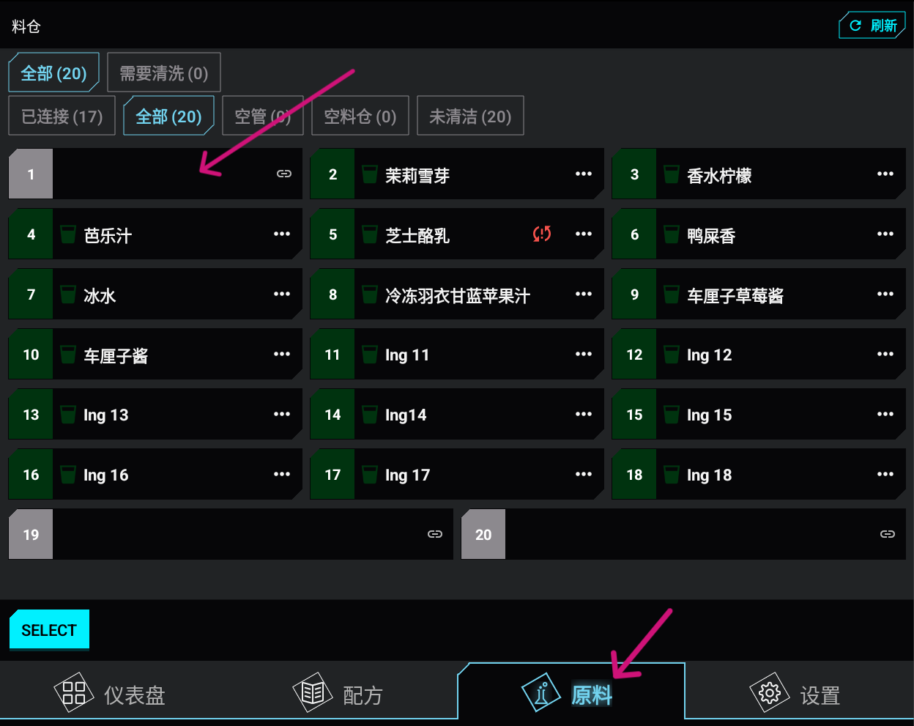
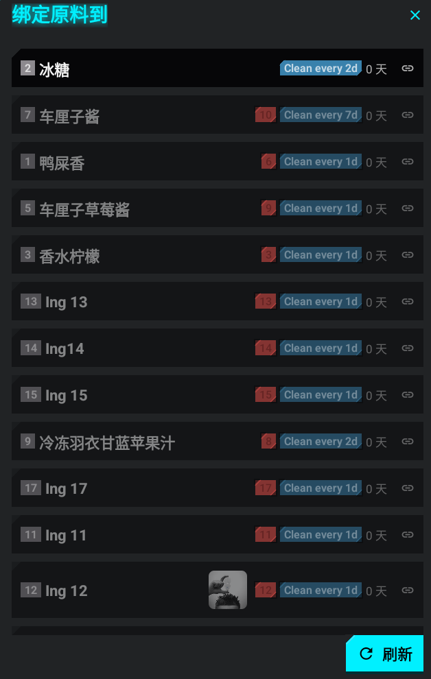
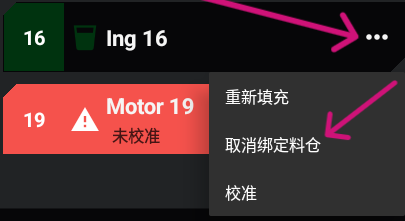
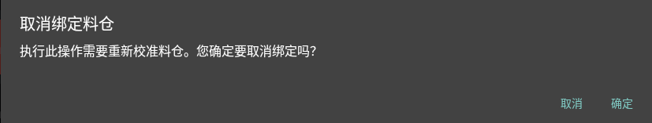

# :material-link-variant: 将原料绑定到容器

1. 打开**容器**页面。
   
2. 点击空容器，或尚未分配原料的容器。
   
3. 从可用原料列表中选择原料。
   
4. 确认容器上显示原料名称。 

## 解除原料绑定

1. 打开**容器**页面。
2. 点击容器旁边的**菜单图标（三个竖点）**。
   
3. 选择**解除容器绑定**。

       

4. 确认操作。
   
