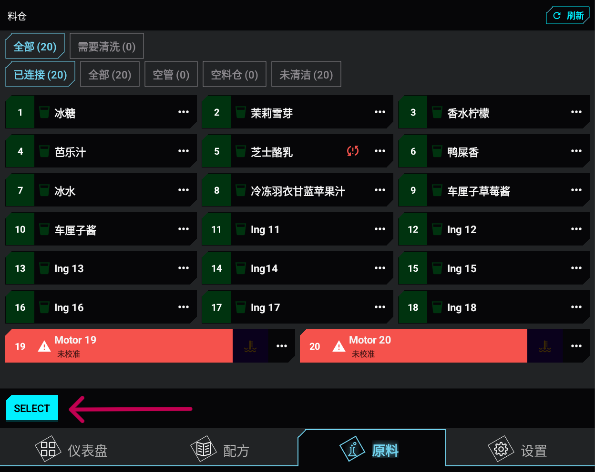
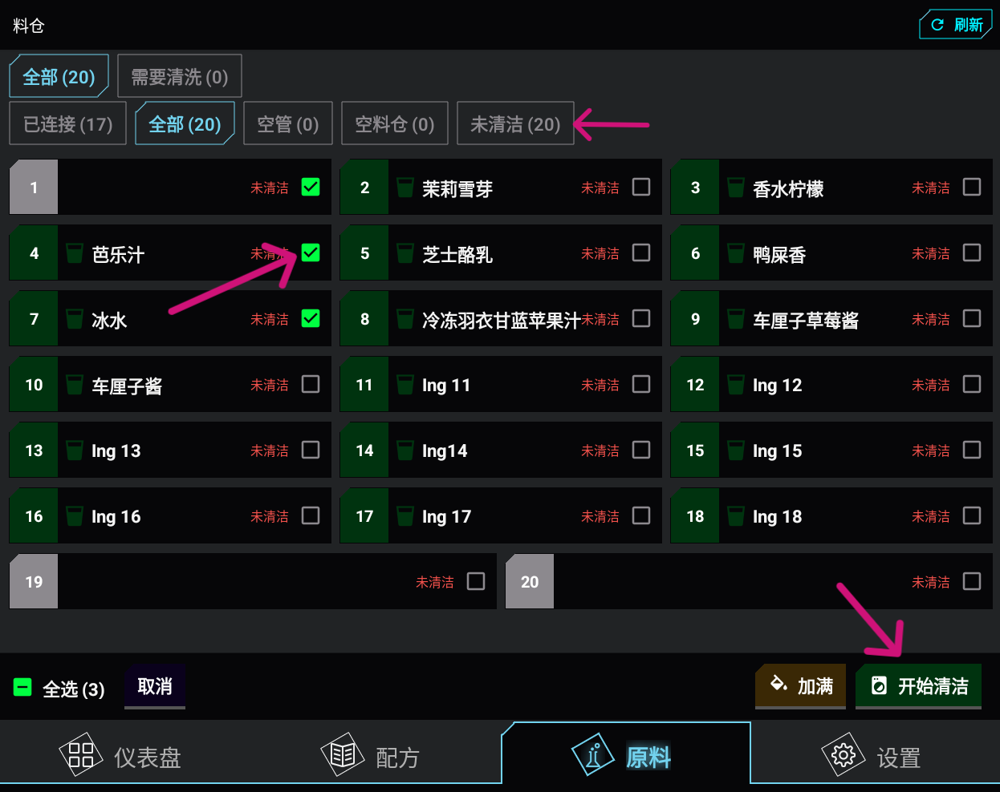
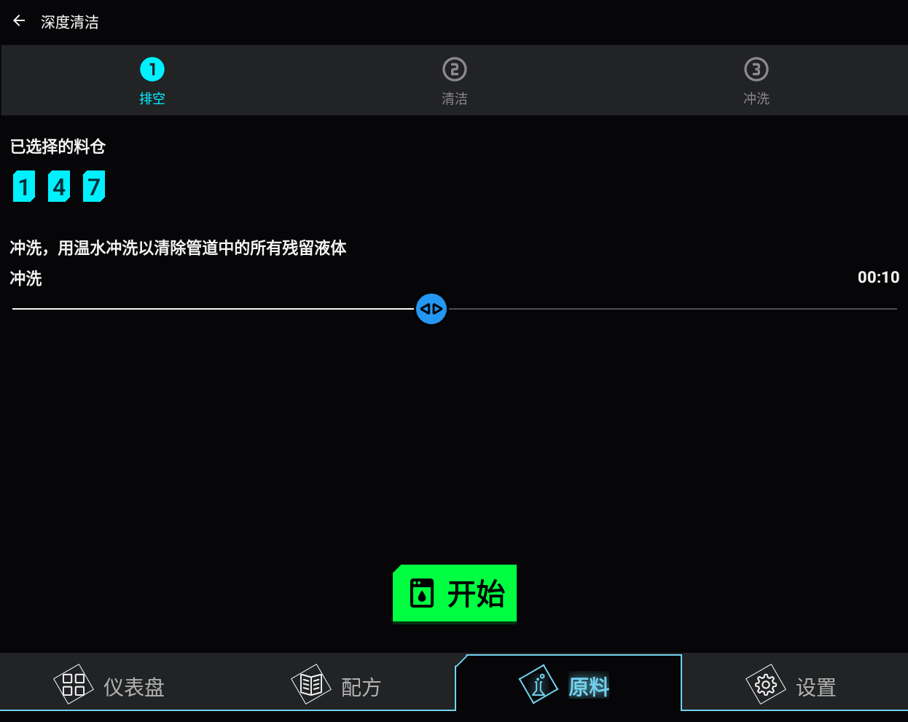
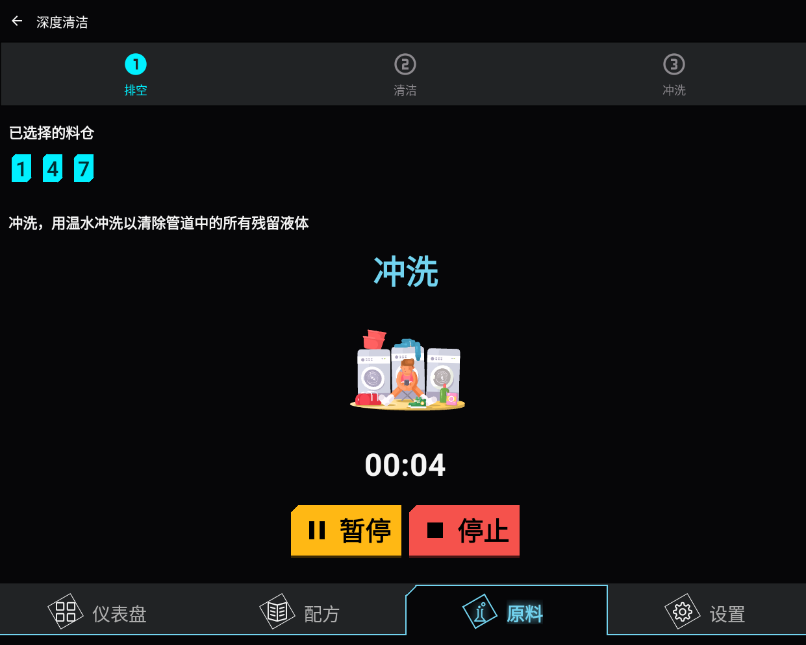
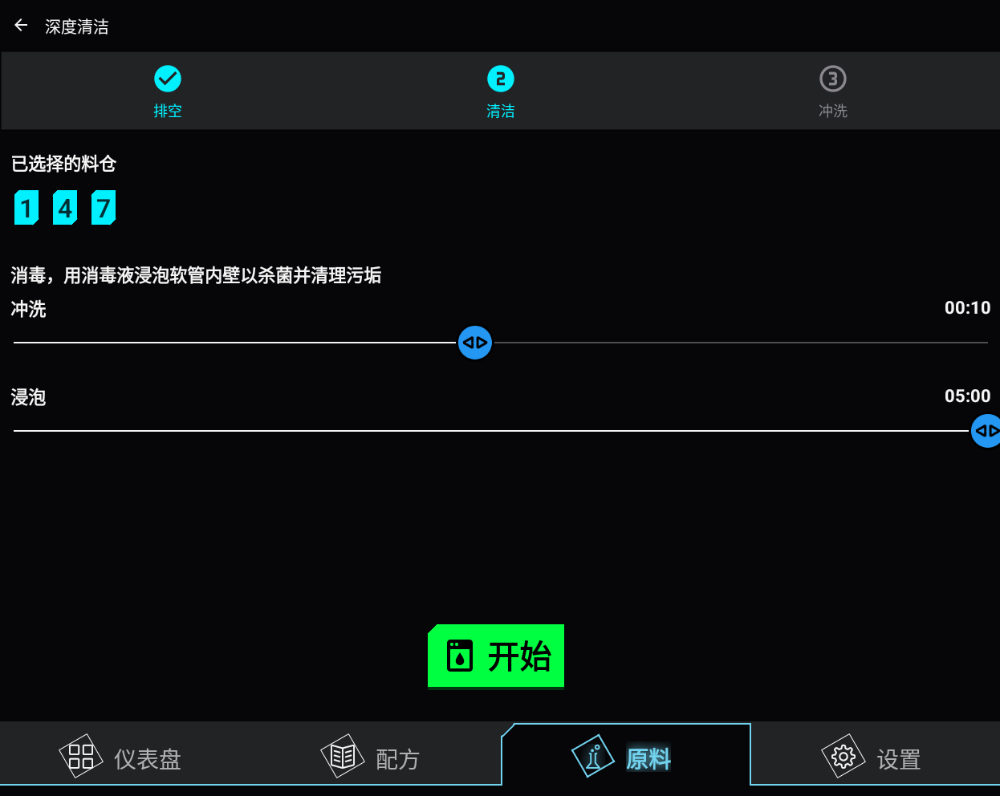
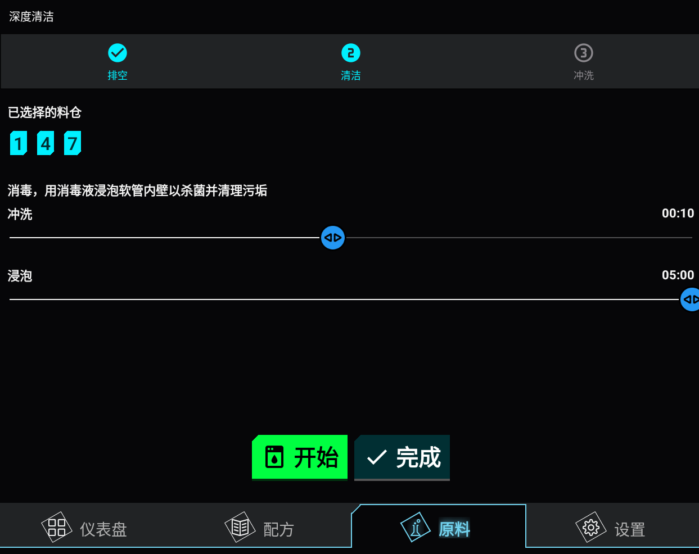
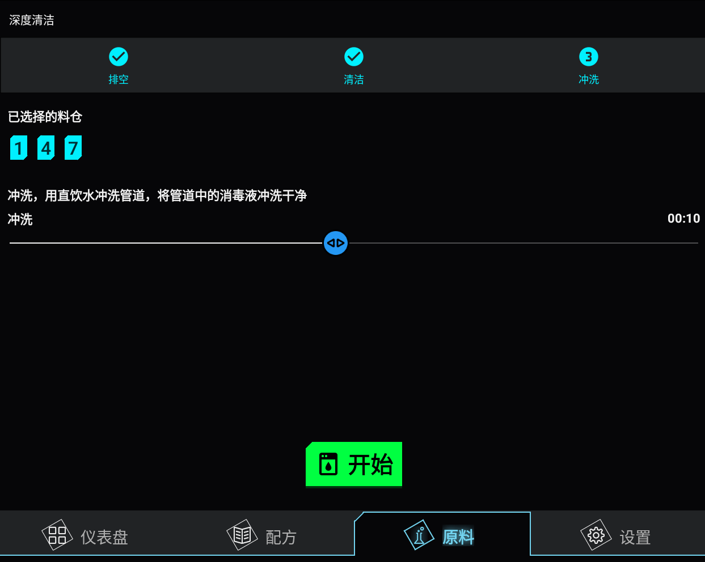
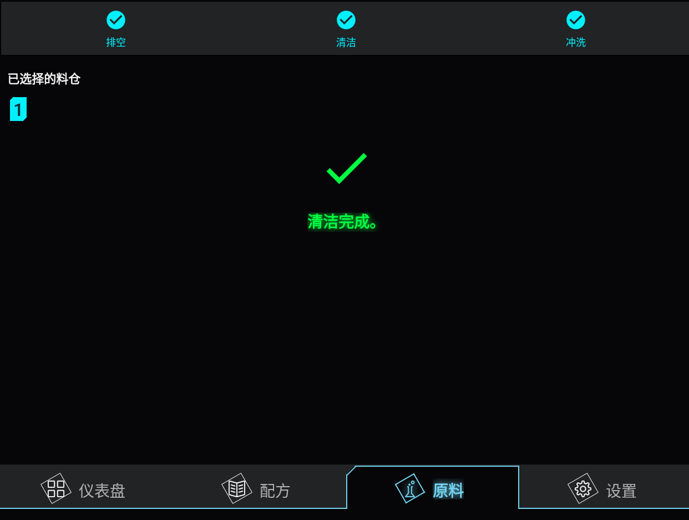

# :material-broom: 清洗

1. 移除秤把手，并将大容器放在出料口下方。 
2. 将管道从容器上断开，并放入装有热水的大容器中。 
3. 打开**容器**页面。 
4. 点击底部的**选择**。
   
5. 选择要清洗的容器。使用顶部标签导航器查看尚未清洗且需要清洗的容器。 
6. 点击**清洗**。
   
7. 在**排空管道**步骤中选择时长或使用默认值，然后点击**开始**。
   
8. 等待**排空管道**步骤完成。
   
9. 确保出料口下方的容器为空。将装有管道的容器中的热水更换为热水和所需的清洗液。
   
10. 选择出料时长和浸泡时长，然后点击**开始**。 
11. **浸泡**步骤完成后，再重复一次或结束清洗流程。建议每天早上执行一次；每周深度清洗时重复多次。
    
12. 在最后的**排空管道**步骤中，移走出料口下方的容器，并将热水容器中的水更换为热水。 
13. 选择时长，然后点击**开始**。
    
14. 等待清洗流程完成。
    
