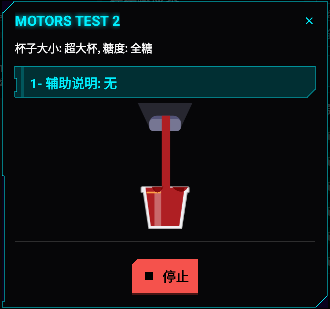
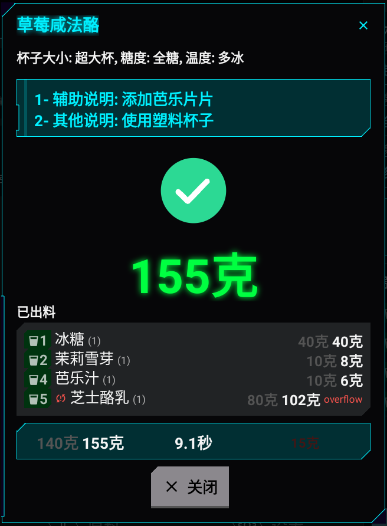
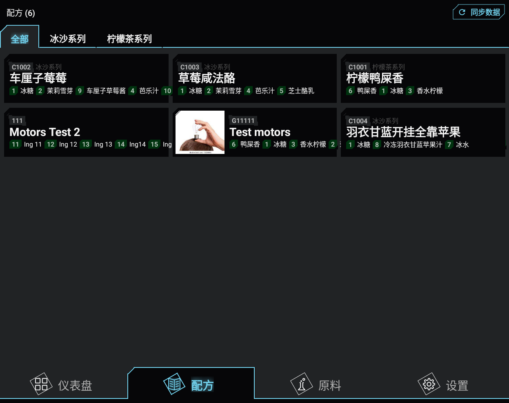
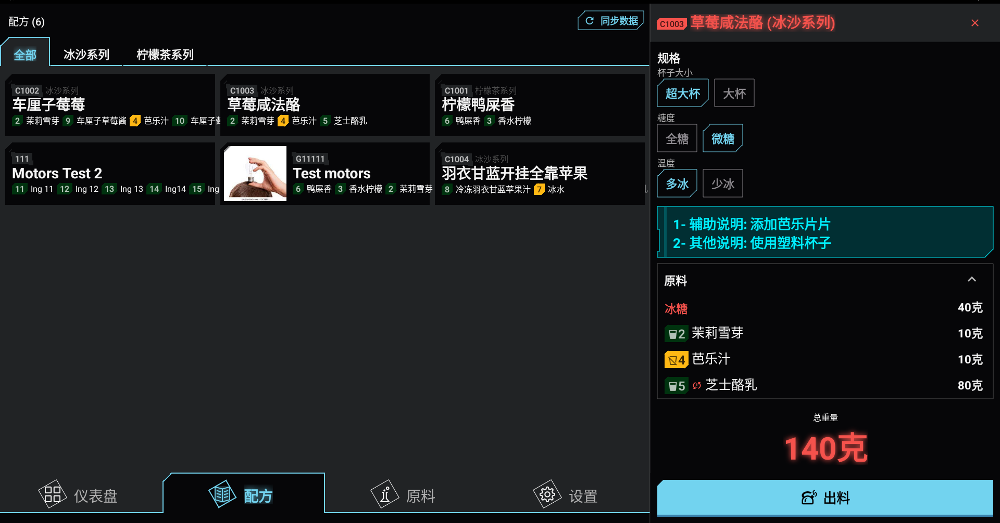
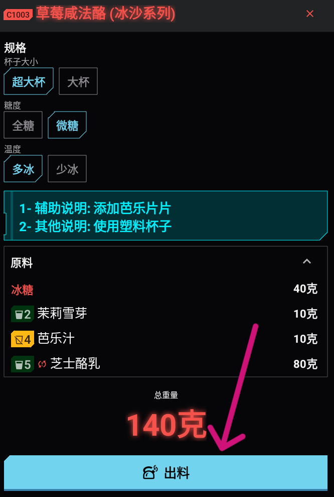

# :material-glass-cocktail: 出料饮品

## 使用二维码

1. 将杯子放在出料口下方。 
2. 扫描包含配方及其规格的二维码。 
3. 等待出料流程自动完成。
   
4. 查看完成摘要。
   

## 使用配方页面

1. 打开**配方**。
   
2. 选择配方。
   
3. 选择所需规格。
   
4. 将杯子放在出料口下方。
   
5. 点击**出料**。

      

6. 等待出料流程完成。
   
7. 查看完成摘要。
   
