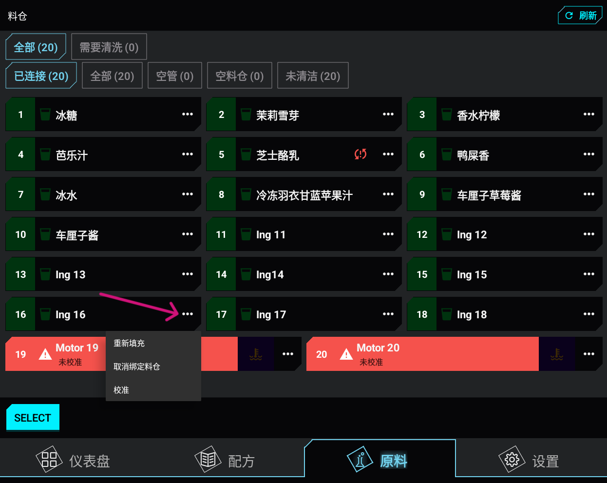
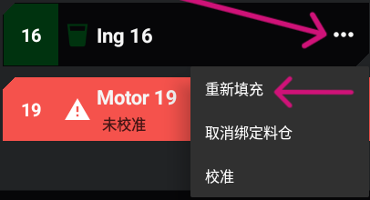
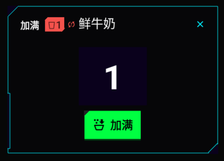
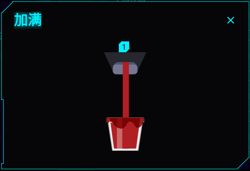
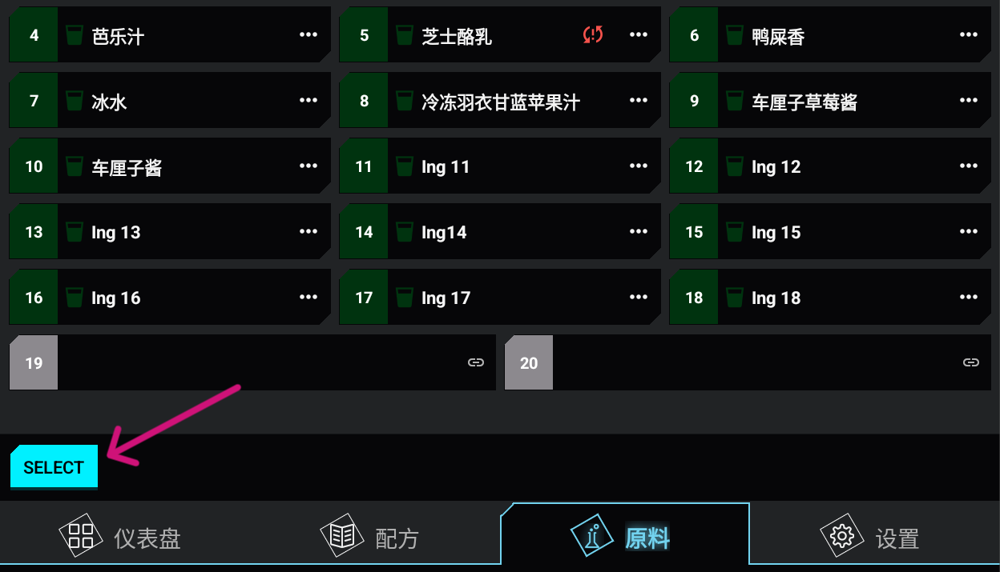
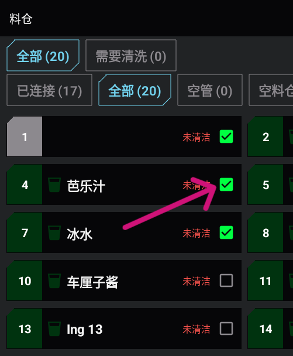
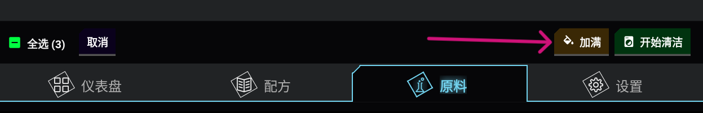
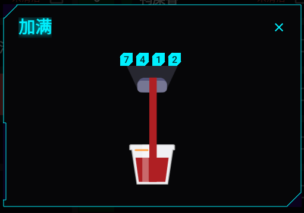

# :material-water-plus: Filling and Initiating Containers

1. Refill the pot with the required fluid.
2. Place a large cup under the dispenser.
3. Open the **Pots** screen.
   
4. Tap the **Menu icon (three vertical dots)** on the pot.
   
5. Select **Refill**.

        

6. Tap **Top Up**.

       

7. Wait for the brief initialization to finish, if it starts.
   

## Refilling Multiple Pots

1. Refill the pots with the required fluids. 
2. Place a large cup under the dispenser. 
3. Open the **Pots** screen. 
4. Tap **Select** in the footer.
   
5. Select the pots you refilled.
   
       

6. Tap **Refill**.
   
7. Wait for the pots to initiate one by one.
   
8. Confirm the process.

       
