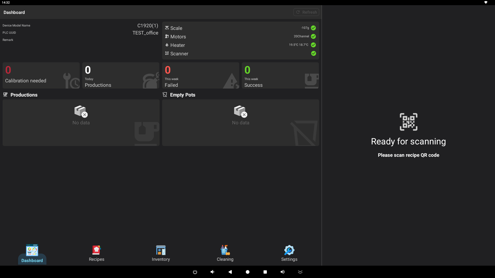
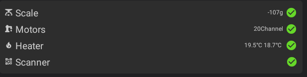
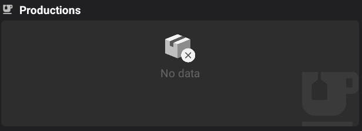
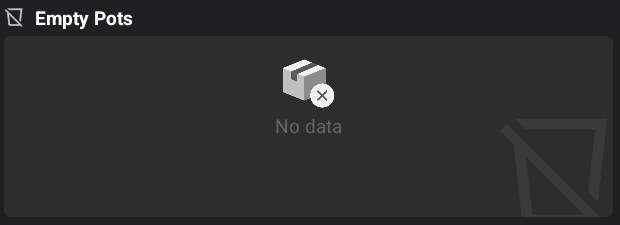

# :material-view-dashboard: User Guide: Home Screen Dashboard

The Home screen is the central dashboard for the mixer system. It provides real-time information about the machine's status, recent activities, and essential maintenance requirements.

## 1. Machine Information
Located at the top left of the dashboard, this section displays details about the current machine and store.

- **Store Details**: Shows the store name, store code, and store type.
- **Machine Details**: Includes the device model name, hardware version, and unique PLC identifier (PLC UUID).
- **Network Status**: If the machine loses WiFi or internet connectivity, a warning will appear here with a button to open the system's WiFi settings.
- **Refresh**: Use the refresh button in the header or within this panel to update the machine information from the server.

## 2. Hardware Component Status
The status panel at the top right monitors the health and current readings of the machine's critical hardware.

- **Scale**: Displays the current net weight in grams. A green checkmark indicates the scale is online. Tapping this item allows you to perform a weight calibration or test.
- **Motors**: Shows the number of active motor channels and their connection status.
- **Heaters**: Displays the current temperature (in °C) for the heating elements.
- **Scanner**: Indicates whether the QR code/barcode scanner is ready to process orders.

## 3. Usage Statistics
This section provides a quick summary of the machine's performance and maintenance needs.

- **Calibration Needed**: Shows the number of ingredient pots that require calibration. Tapping this card will take you to the calibration settings.
- **Today's Orders**: Displays the total number of recipes successfully produced today. Tapping this card opens the detailed order log.
- **This Week (Failed)**: Shows the count of failed production attempts during the current week.
- **This Week (Success)**: Shows the total number of successful productions during the current week.

## 4. Recent Recipes & Activity
A live feed of the most recent production records.

- **Recipe List**: Shows the name of the recipe, the target volume (in ml), and any weight error detected during production.
- **Order ID**: Displays the unique order identifier for each production.
- **Status Indicators**: Failed productions are crossed out and marked with a red alert icon.
- **Time**: Shows exactly when each recipe production started.
- **Details**: Tapping any recipe in this list will open the detailed recipe view.

## 5. Low/Empty Pots Management
Monitors the ingredient levels in the machine.

- **Low Ingredients**: Lists all pots where the ingredient level is low (below 1500ml) or empty.
- **Refilling**: Tap on any ingredient in this list to open the refill interface, allowing you to top up the pot and update the system's inventory.

---
*Tip: If you encounter any hardware warnings (red icons), check the Hardware Status panel first to identify the affected component.*
