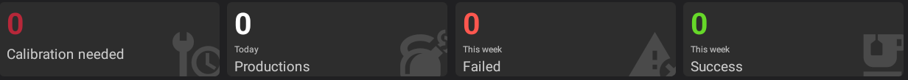

# :material-view-dashboard: User Guide: Home Screen Dashboard

The Home screen provides an overview of the machine status, activity, and maintenance needs.

## 1. Usage Statistics
Summarizes machine performance and maintenance needs.

- **Calibration Needed**: Shows pots requiring calibration.
- **Today's Orders**: Shows recipes successfully produced today.
- **This Week (Failed)**: Shows failed production attempts this week.
- **This Week (Success)**: Shows successful productions this week.

## 2. Recent Recipes & Activity
Lists recent production records.
 

- Shows the recipe, target volume, weight error, order ID, status, and start time.
- Tap a recipe to open its details.

## 3. Low/Empty Pots Management
Shows low or empty ingredient pots.
 

- **Low ingredients**: Lists pots below 1500 ml or empty.
- **Refilling**: Tap an ingredient to open the refill interface.

---
*Tip: Check the Hardware Status panel first when a red hardware warning appears.*
