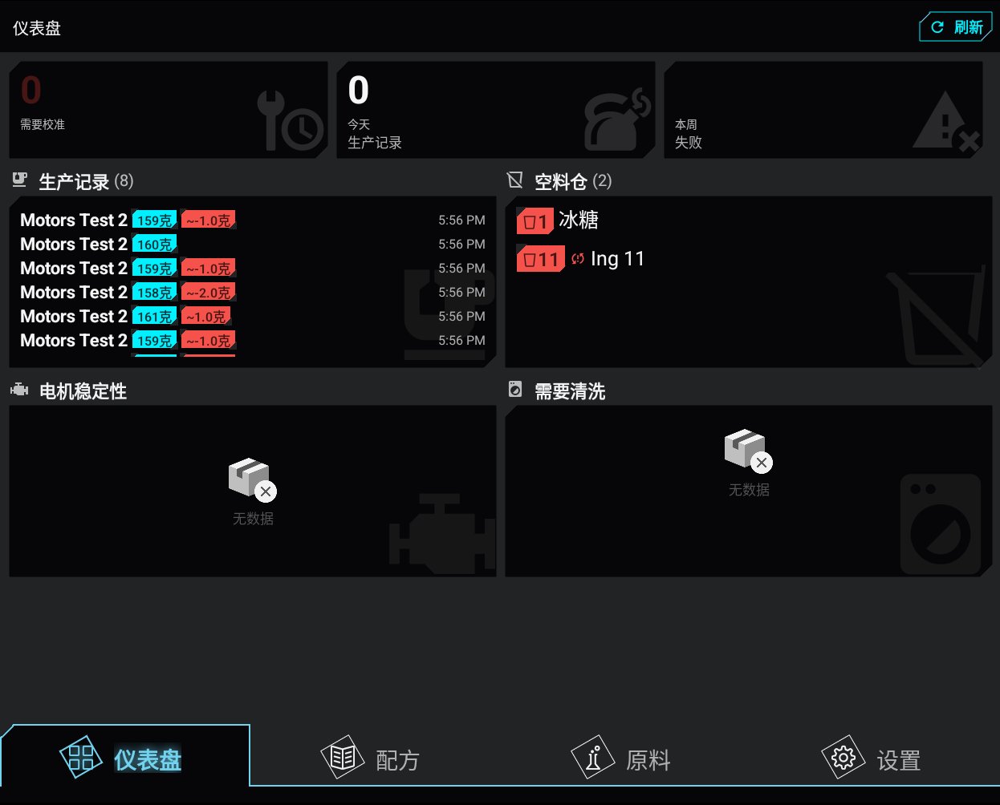
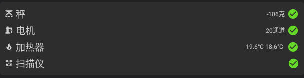
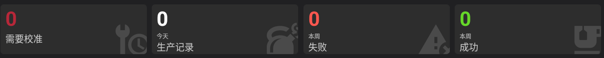

# :material-view-dashboard: 用户指南：主屏幕仪表板

主屏幕显示机器状态、近期活动和维护需求。

## 1. 机器信息
显示当前门店和机器信息。

- **门店和机器信息**：显示门店、设备型号、硬件版本和 PLC UUID。
- **网络状态**：WiFi 或互联网断开时显示警告。
- **刷新**：从服务器更新信息。

## 2. 硬件组件状态
显示关键硬件的状态和读数。

- **天平**：显示当前净重和在线状态。点击可校准或测试天平。
- **电机**：显示活动电机通道及连接状态。
- **加热器**：显示当前温度。
- **扫描仪**：显示扫描仪是否准备就绪。

## 3. 使用统计
汇总机器性能和维护需求。

- **需要校准**：显示需要校准的容器。
- **今日订单**：显示今天成功制作的配方。
- **本周（失败）**：显示本周失败的生产次数。
- **本周（成功）**：显示本周成功的生产次数。

## 4. 近期配方与活动
列出最近的生产记录。

- 显示配方、目标体积、重量误差、订单 ID、状态和开始时间。
- 点击配方可查看详情。

## 5. 低液位/空容器管理
显示液位较低或为空的原料容器。

- **低原料**：列出液位低于 1500 毫升或已空的容器。
- **加料**：点击原料打开加料界面。

---
*提示：出现红色硬件警告时，先检查“硬件状态”面板。*
