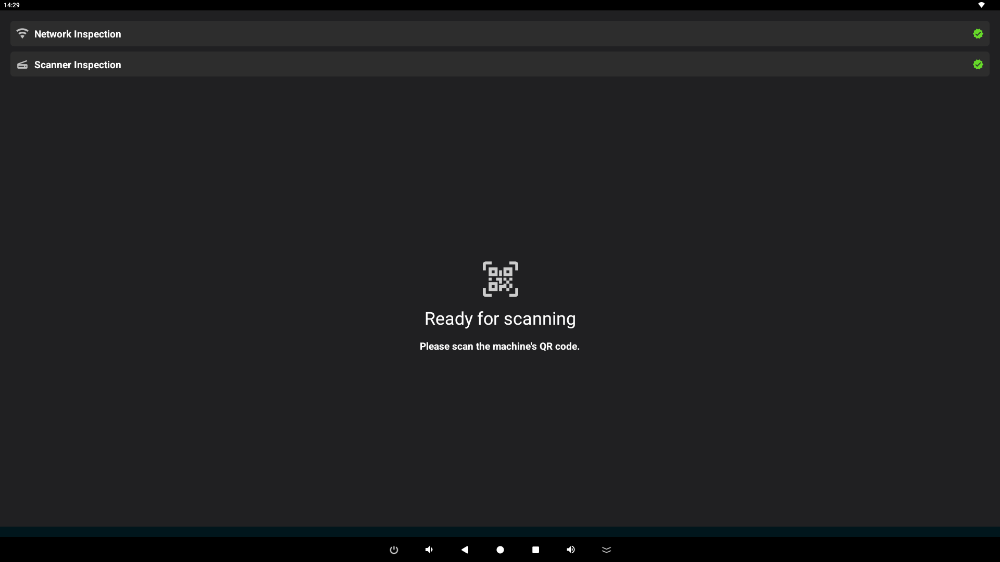
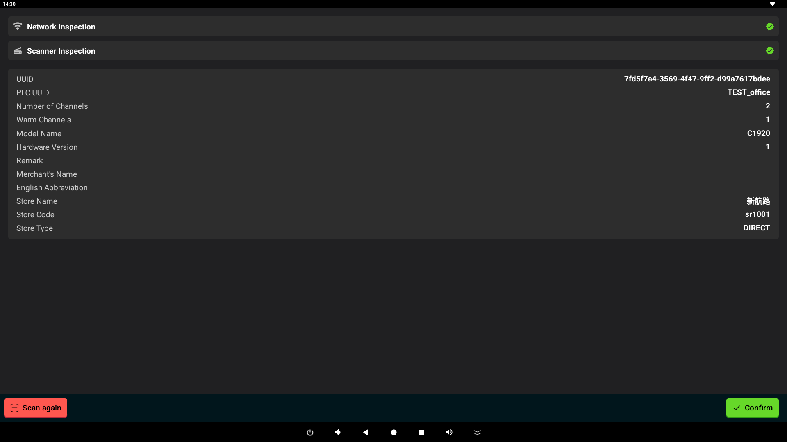
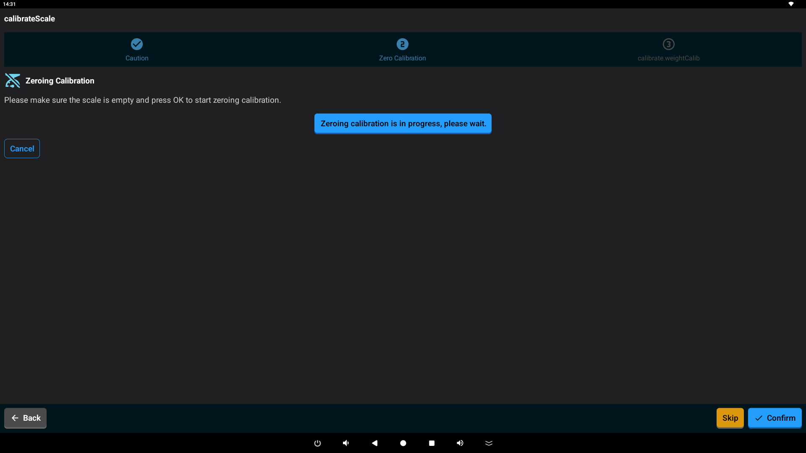
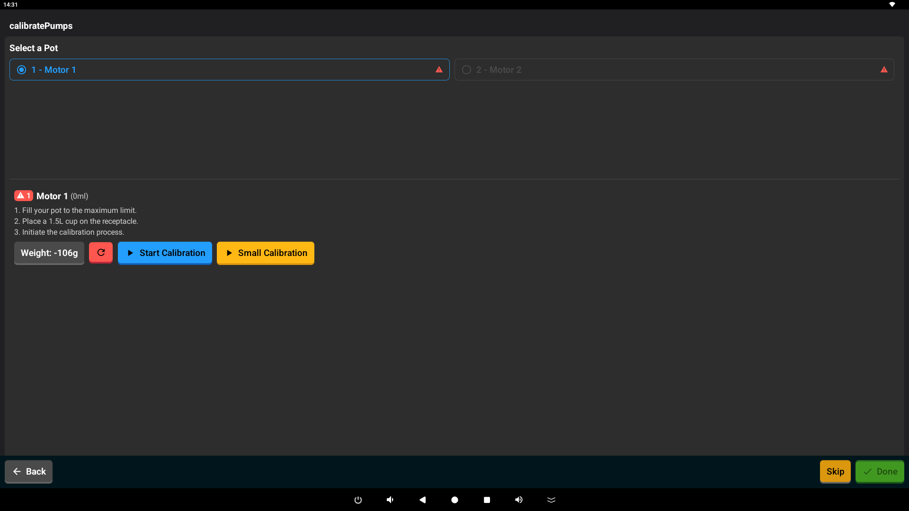

# :material-cog: Setting Up Your Mixer

This guide will help you through the first-time setup of your Mixer machine. The setup wizard is designed to prepare the machine for use, ensuring everything is calibrated and ready to go.

## Overview

The setup process is a simple, step-by-step guide. When you begin, the machine will reset to its factory state:
- Any current user will be signed out.
- Previous settings will be cleared.
- All ingredient containers will be reset.
- The recipe list will be refreshed.

The guide consists of several easy steps.

## Setup Steps

### 1. Connect and Identify
The first step is to connect your machine to the internet and identify it.

*Scan the QR code on the back or side of your machine.*

- **Wi-Fi Connection**: Make sure your machine is connected to a reliable Wi-Fi network.
- **Scanning**: Use the app to scan the QR code on your machine. This helps the app recognize your specific device.
- **Registration**: The app will automatically register your machine with our service.
- **Checking Components**: The machine will perform a quick check of its internal parts, like the scanner and pumps.
- **Loading Data**: Your machine will download the latest configuration and available ingredients.

### 2. Scale Calibration
Next, you will be guided through making sure the built-in scale is accurate.

*The scale calibration screen.*

- **Accuracy Check**: This step ensures that the scale measures ingredients correctly.
- **Zeroing**: You'll be asked to make sure the scale reads zero when empty.
- **Weight Check**: You might be asked to place a known weight to confirm accuracy.
- **Next Step**: Once the scale is accurate, you can move to the next part.

### 3. Pump Calibration
This step ensures that the machine dispenses the exact amount of each ingredient. 

*Testing each pump for accuracy.*

- **Dispensing Accuracy**: Each pump is tested to make sure it delivers the right amount of liquid.
- **Validation**: You will confirm that each ingredient container is ready and calibrated.
- **Ready to Use**: Once confirmed, your machine is officially set up and ready to use! You will be taken to your main Dashboard.

## Finishing Setup
Once you finish the pump calibration:

*Your machine's main dashboard.*

1. Your machine is marked as "Ready."
2. You will be taken to your **Dashboard**, where you can start making recipes!
