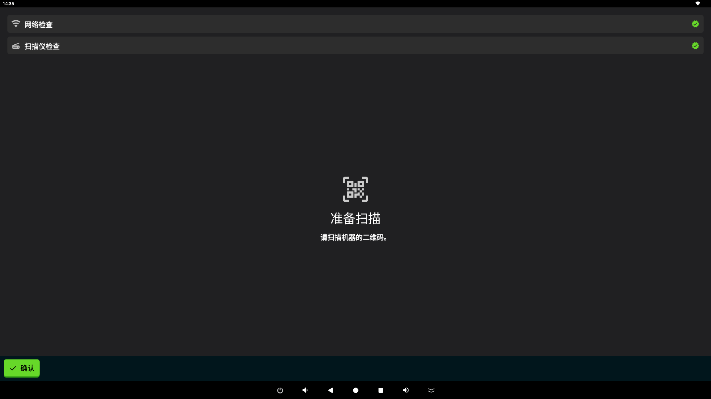
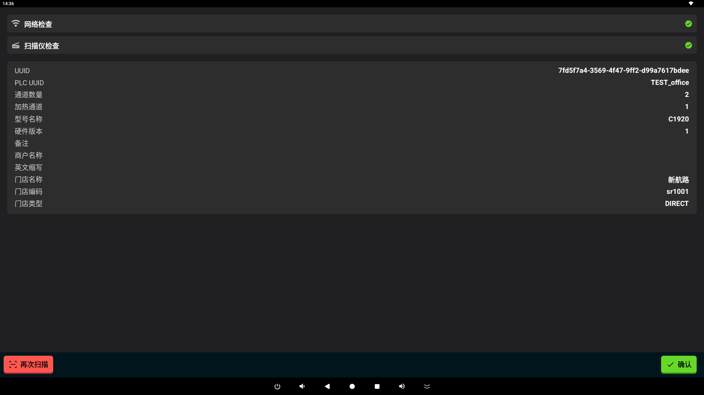
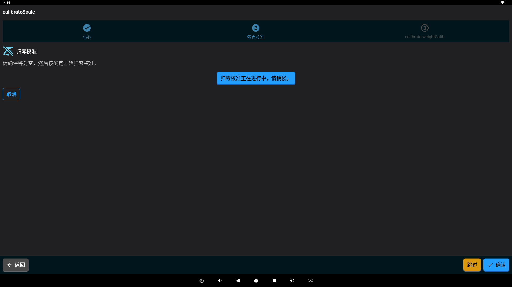
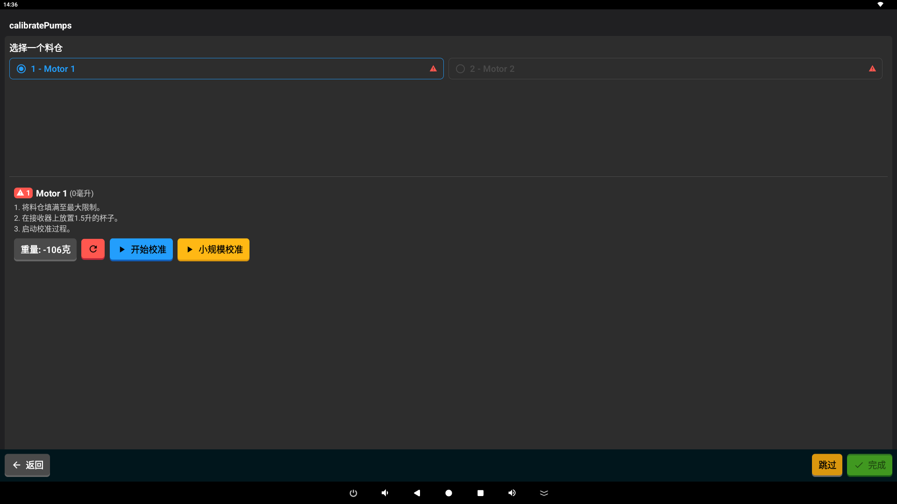
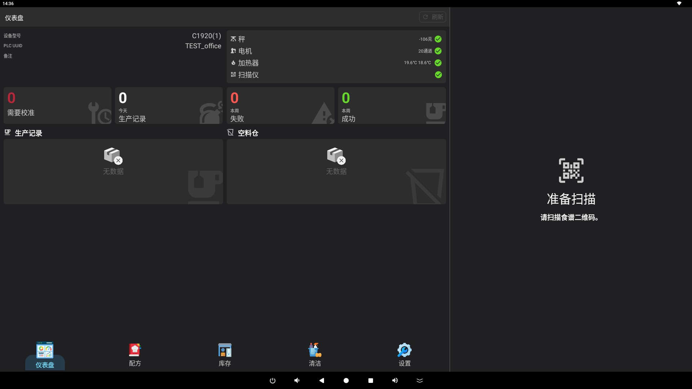

# :material-cog: 设置您的 Mixer

本指南将帮助您完成 Mixer 机器的首次设置。设置向导旨在为使用机器做好准备，确保一切都经过校准并就绪。

## 概览

设置过程是一个简单的分步指南。开始时，机器将恢复到出厂状态：
- 当前任何用户都将注销。
- 之前的设置将被清除。
- 所有原料容器将被重置。
- 配方列表将被刷新。

该指南包含几个简单的步骤。

## 设置步骤

### 1. 连接与识别
第一步是将您的机器连接到互联网并进行识别。

*扫描机器背面或侧面的二维码。*

- **Wi-Fi 连接**：确保您的机器连接到可靠的 Wi-Fi 网络。
- **扫描**：使用应用扫描机器上的二维码。这有助于应用识别您的特定设备。
- **注册**：应用将自动在我们的服务中注册您的机器。
- **检查组件**：机器将对内部零件进行快速检查，例如扫描仪和泵。
- **加载数据**：您的机器将下载最新的配置和可用原料。

### 2. 秤校准
接下来，您将按照指引确保内置秤准确。

*秤校准屏幕。*

- **准确性检查**：此步骤确保秤能正确测量原料。
- **归零**：您将被要求确保秤在空载时读数为零。
- **重量检查**：您可能会被要求放置一个已知重量的物体以确认准确性。
- **下一步**：一旦秤准确，您就可以进行下一部分。

### 3. 泵校准
此步骤确保机器为每种原料出料准确的量。

*测试每个泵的准确性。*

- **出料精度**：测试每个泵以确保其输送正确数量的液体。
- **验证**：您将确认每个原料容器均已准备就绪并经过校准。
- **准备就绪**：确认后，您的机器正式设置完毕并可以开始使用！您将被带到主仪表板。

## 完成设置
完成泵校准后：

*机器的主仪表板。*

1. 您的机器被标记为“就绪”。
2. 您将被带到**仪表板**，在那里您可以开始制作配方！
