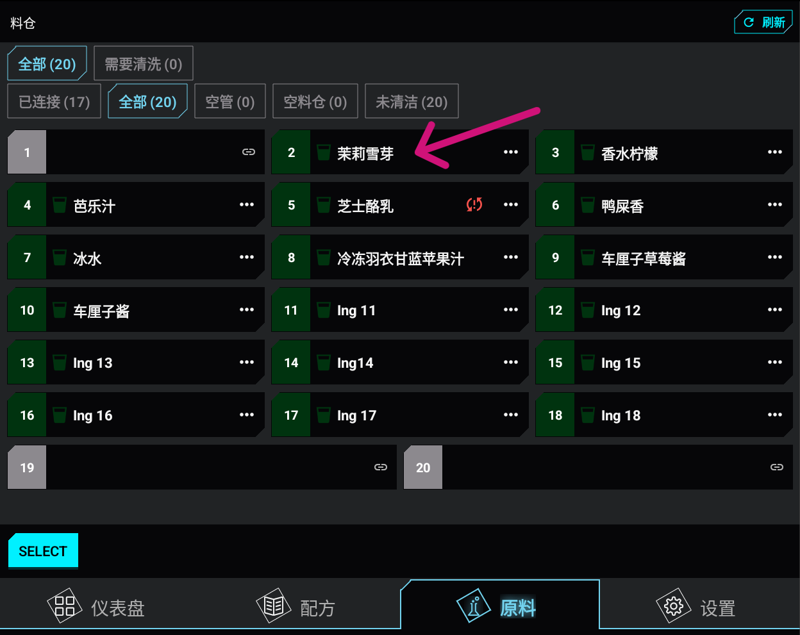
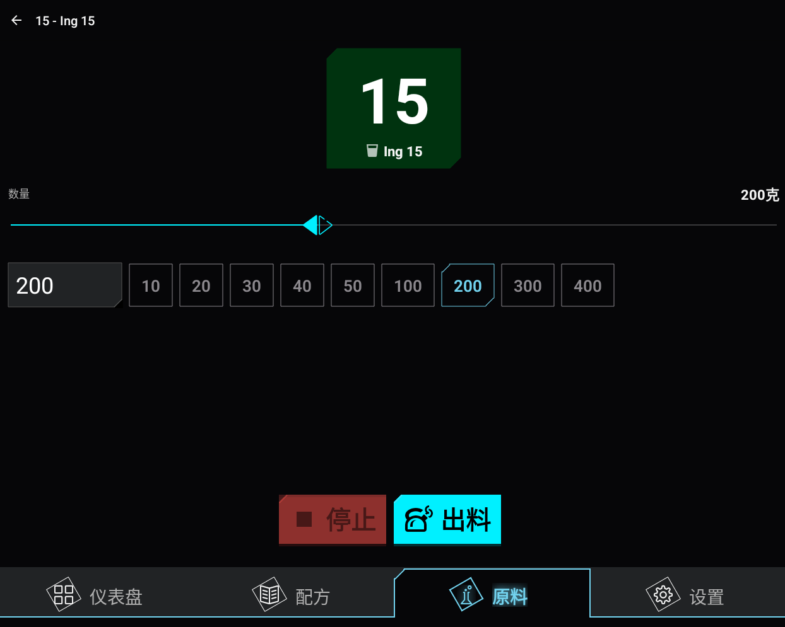
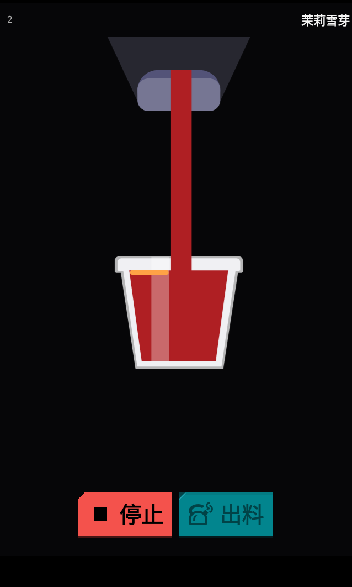

# :material-scale-balance: 手动出料

您可以手动出料指定数量的原料。

1. 打开**容器**页面。 
2. 点击要出料的容器。容器详情会在侧边栏中打开。
   
3. 选择或输入所需的重量，单位为克（g）。
   
4. 将杯子放在出料口下方。 )
5. 点击**出料**。 
6. 查看实时出料重量和最终准确度摘要。
   
7. 如需中断流程，点击**停止**。 
