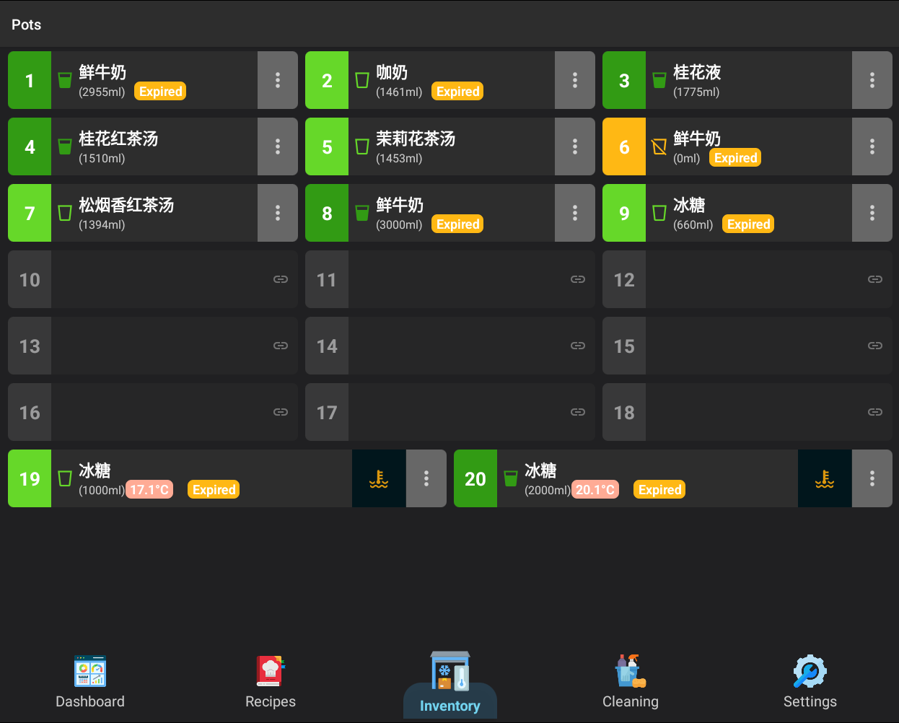
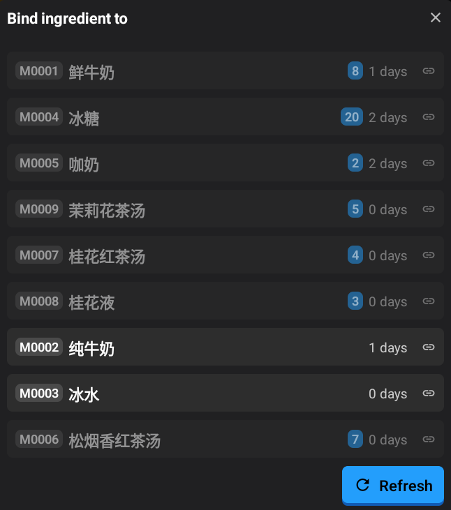
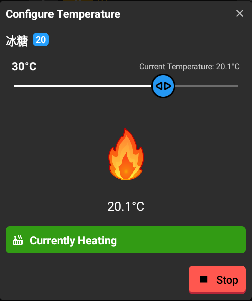
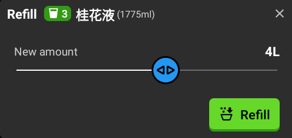
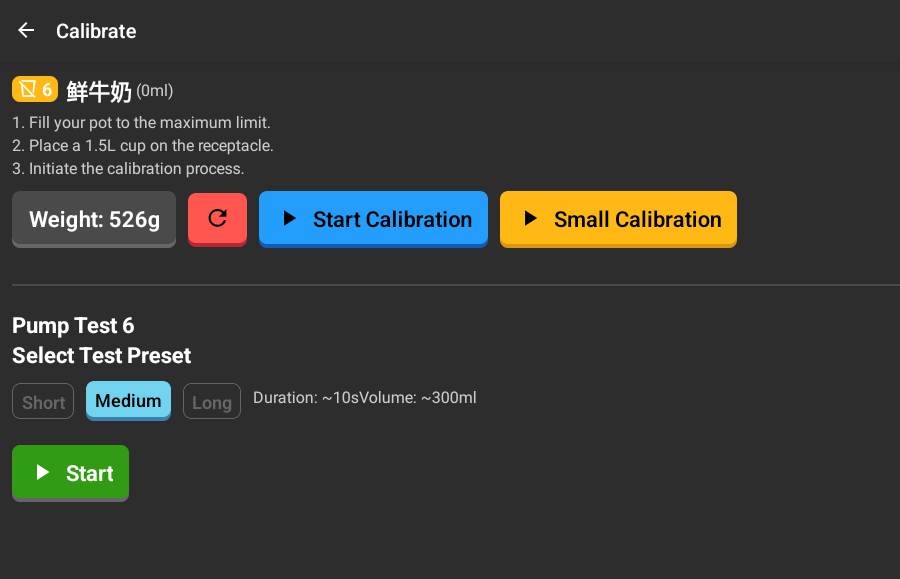
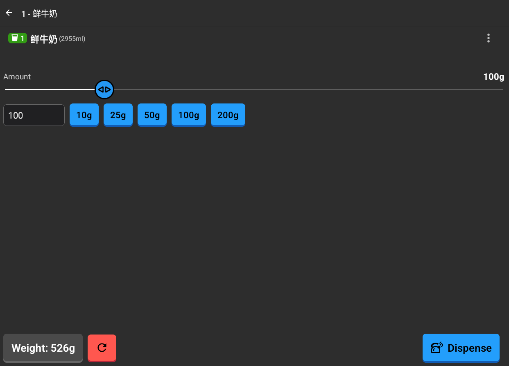

# :material-cup-water: Pots Management Documentation

The **Pots Management** feature allows you to monitor and manage the ingredients stored in the machine's individual containers (pots). Each pot is assigned a number and can be linked to a specific ingredient, heated, and manually dispensed.

---

## 📋 Overview of Pots

The **Pots** screen displays all available containers. Each pot card shows:
- **Pot Number**: The unique identifier for the container.
- **Ingredient Name**: The name of the linked ingredient (if assigned).
- **Fill Level**: The current volume in milliliters (ml).
- **Temperature**: Current and target temperature (if heating is active).
- **Status Badges**: Indicators for calibration status (e.g., "Uncalibrated", "Stale") or expiration.

---

## 🔗 Binding and Unbinding Ingredients

To use a pot, it must be "bound" to an ingredient from the system's material list.

### Binding a Pot

1. Tap an empty pot (or a pot with no ingredient assigned).
2. A list of available materials/ingredients will appear.
3. Select the ingredient you wish to link to this pot.
4. The pot will now display the ingredient name and default expiration settings.

### Unbinding a Pot
1. Tap the **Menu icon (three vertical dots)** on a pot card.
2. Select **Unbind Pot**.
3. Confirm the action. This will clear the ingredient assignment and reset the fill level.

---

## 🌡️ Temperature Control

*Pots will not heat up unless the temperature is manually set.*

If a pot is equipped with a heater, you can control its temperature.

1. Tap the **Temperature icon** on the pot card (or access it via the Pot Menu).
2. Use the slider to set the desired temperature (typically between 10°C and 40°C).
3. Tap **Set** to start heating.
4. You can monitor the "Current Temperature" in real-time.
5. Tap **Stop** at any time to turn off the heater.

---

## 💧 Refilling and Depleting Pots

*The slider shows the current fill level in milliliters (ml).*
Keep track of the ingredient levels to ensure the machine can complete recipes.

### Refilling (Top Up)
1. Tap the **Menu icon** and select **Refill** (or tap the pot if the fill level is critically low).
2. Adjust the slider to reflect the new total volume in the pot.
3. Tap **Top Up** to save the changes. The machine may perform a brief initialization.

### Depleting (Clear)
1. Tap the **Menu icon** and select **Clear**.
2. This will reset the pot's current fill level to 0ml, indicating it is empty.

---

## ⚖️ Calibration and Maintenance

Accurate dispensing depends on proper calibration.

- **Calibrate**: If a pot shows "Uncalibrated", you must perform a calibration process (accessible via the Menu) to ensure accurate measurements.
- **Recalculate Regression**: Advanced maintenance option to refine dispensing accuracy based on historical data.
- **Reset Errors**: If a pot has encountered multiple dispensing errors, you can clear the error history via the Menu once the issue is resolved.

---

## 🧪 Manual Dispensing

*The slider shows the current fill level in milliliters (ml).*

*Shows the current weight being dispensed in grams (g).*

*The final summary of the dispensing process.*

You can manually dispense a specific amount of an ingredient for testing or custom use.

1. Tap the main body of a bound pot card to open the **Pot Details** screen.
2. Select or enter the desired amount in grams (g).
3. Ensure a cup is placed under the dispenser.
4. Tap **Dispense**.
5. The screen will show the real-time weight being dispensed and a final summary of accuracy.
6. Use the **Stop** button if you need to interrupt the process.
