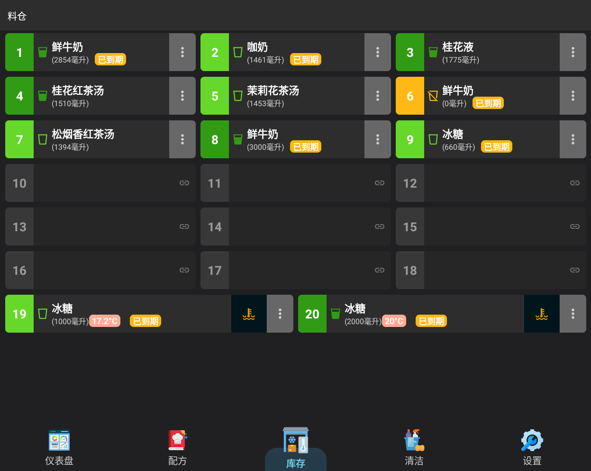
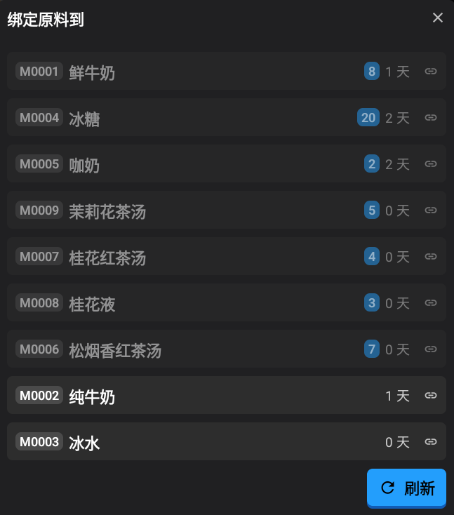
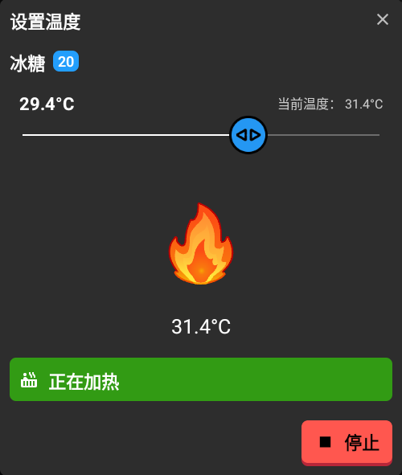
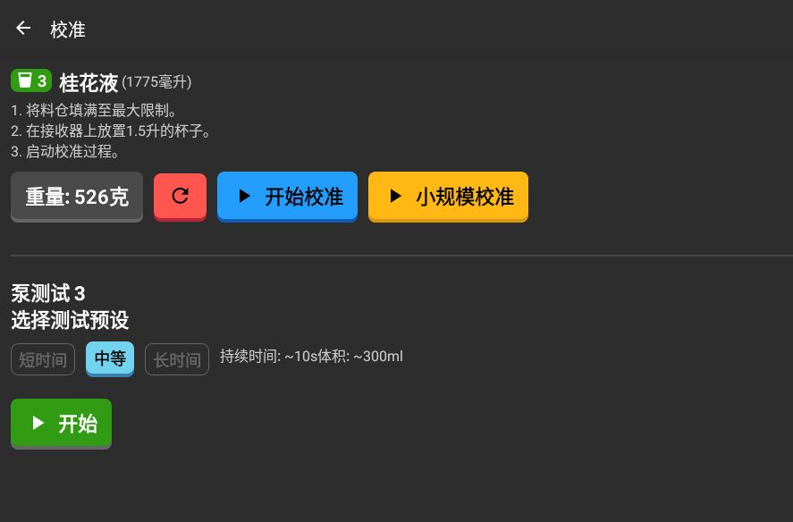
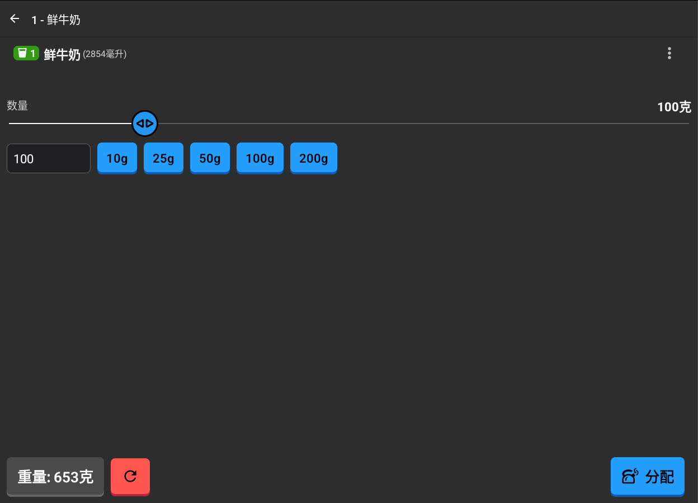

# :material-cup-water: 容器管理 (Pots Management) 文档

**容器管理 
(Pots Management)** 功能允许您监控和管理存储在机器各个容器（Pots）中的原料。每个容器都分配有一个编号，并可以关联到特定的原料、加热以及手动分配。

---

## 📋 容器概览

**容器 (Pots)** 屏幕显示所有可用的容器。每个容器卡片显示：
- **容器编号 (Pot Number)**：容器的唯一标识符。
- **原料名称 (Ingredient Name)**：关联原料的名称（如果已分配）。
- **填充液位 (Fill Level)**：当前体积，以毫升 (ml) 为单位。
- **温度 (Temperature)**：当前温度和目标温度（如果加热已激活）。
- **状态徽章 (Status Badges)**：校准状态指示器（例如“未校准”、“陈旧”）或过期提醒。

---

## 🔗 绑定与解绑原料

要使用容器，必须将其与系统材料列表中的某种原料“绑定”。

### 绑定容器

1. 点击一个空容器（或未分配原料的容器）。
2. 将出现可用材料/原料列表。
3. 选择您希望链接到此容器的原料。
4. 容器现在将显示原料名称和默认的过期设置。

### 解绑容器
1. 点击容器卡片上的 **菜单图标（三个垂直点）**。
2. 选择 **解绑容器 (Unbind Pot)**。
3. 确认操作。这将清除原料分配并重置填充液位。

---

## 🌡️ 温度控制

如果容器配备了加热器，您可以控制其温度。

1. 点击容器卡片上的 **温度图标**（或通过容器菜单访问）。
2. 使用滑块设置所需温度（通常在 10°C 到 40°C 之间）。
3. 点击 **设置 (Set)** 开始加热。
4. 您可以实时监控“当前温度”。
5. 随时点击 **停止 (Stop)** 关闭加热器。

---

## 💧 填充与清空容器

跟踪原料液位以确保机器可以完成配方。

### 填充（加满）
1. 点击 **菜单图标** 并选择 **填充 (Refill)**（或者如果填充液位极低，直接点击容器）。
2. 调整滑块以反映容器中的新总重量/体积。
3. 点击 **加满 (Top Up)** 保存更改。机器可能会执行简短的初始化。

### 清空
1. 点击 **菜单图标** 并选择 **清空 (Clear)**。
2. 这将把容器的当前填充液位重置为 0ml，表示其已空。

---

## ⚖️ 校准与维护

准确的分配取决于正确的校准。

- **校准 (Calibrate)**：如果容器显示“未校准”，您必须执行校准流程（通过菜单访问）以确保测量准确。
- **重新计算回归 (Recalculate Regression)**：高级维护选项，根据历史数据细化分配精度。
- **重置错误 (Reset Errors)**：如果容器多次遇到分配错误，在问题解决后，您可以通过菜单清除错误历史记录。

---

## 🧪 手动分配

您可以手动分配特定量的原料用于测试或自定义用途。

1. 点击已绑定容器卡片的主体部分，打开 **容器详情 (Pot Details)** 屏幕。
2. 选择或输入所需的重量（以克 (g) 为单位）。
3. 确保在出料口下方放置一个杯子。
4. 点击 **出料 (Dispense)**。
5. 屏幕将显示实时出料的重量以及最终的精度摘要。
6. 如果需要中断过程，请使用 **停止 (Stop)** 按钮。
