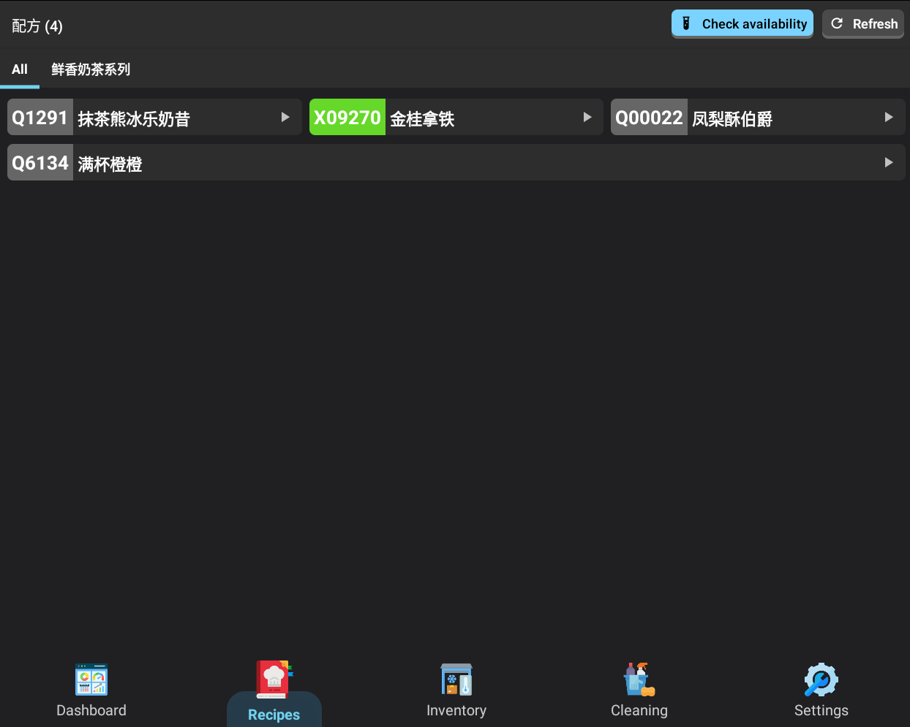
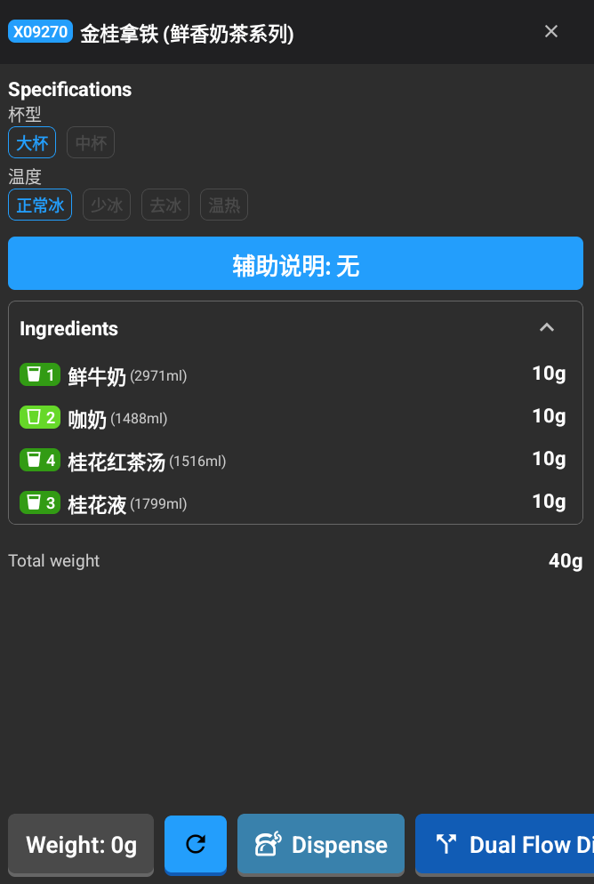
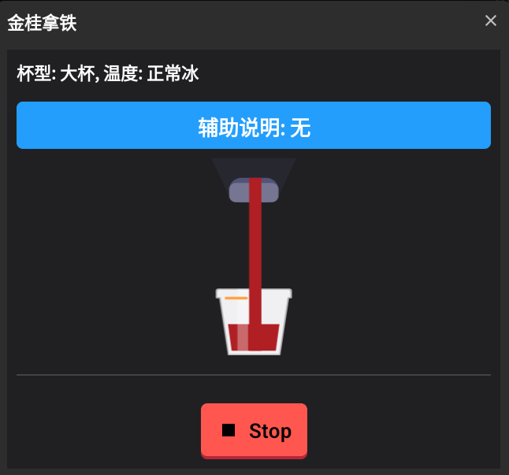
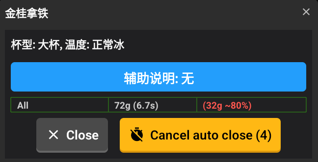

# :material-book-open-variant: Recipes and Dispensing Guide

This guide explains how to use the Recipes and Dispensing features in the Mixer application.

## Overview

The Recipes feature allows you to browse available recipes, select specific versions or sizes, and start the automatic dispensing process.

## Recipe List

The main screen shows all available recipes.

*List of all available recipes.*

- **Categories**: Use the tabs at the top to filter recipes by category.
- **Recipe Cards**: Each recipe shows its name, a unique code, and its type.
- **Check Availability**: Use the "Check Availability" button to see which recipes can be made with the ingredients currently loaded in the machine.

## Recipe Details

Selecting a recipe shows more information and options for preparation.

*Recipe details and version selection screen.*

### 1. Version Selection
Many recipes have different variants or sizes. You can select the one you need, and the required ingredients and total weight will update automatically.

### 2. Ingredient Status
The app will warn you if:
- Any ingredients are missing.
- There isn't enough of an ingredient left.
- The machine's dispensers need calibration.

### 3. Ingredients List
You can see all the ingredients required and the exact amount needed for the selected version.

### 4. Starting the Process
- **Start Dispense**: This begins the automatic mixing and dispensing process.
- **Mode Selection**: Depending on the machine setup, you might be able to choose between a "Quick" or "Standard" dispensing mode.

## The Dispensing Process

While the machine is working, you can see real-time progress on the screen. The machine handles the precise measurement of each ingredient. If any issues occur, like a pump problem or an ingredient running out, the app will notify you immediately.

*Real-time progress while the machine is dispensing.*

## Results and Completion

Once the process is finished, a summary will appear:
- **Status**: Confirms if the process was successful.
- **Weight Accuracy**: Shows how much was actually dispensed compared to the target weight.
- **Automatic Logging**: The machine automatically records the production data for your records.

*Completion summary showing results and weight accuracy.*
