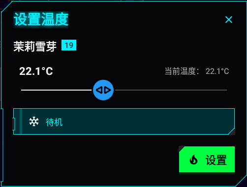
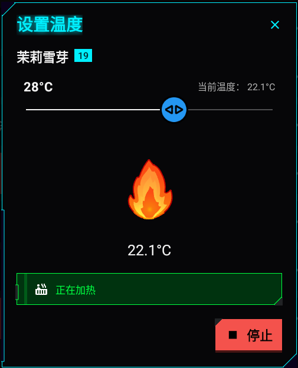

# :material-thermometer: Temperature Control

If a pot is equipped with a heater, you can control its temperature.

1. Tap the **Temperature icon** on the pot card, or access it through the **Pot Menu**.
   
2. Use the slider to set the desired temperature, typically between 10°C and 40°C.
   
3. Tap **Set** to start heating.

       

4. Monitor the **Current Temperature** in real time. 
5. Tap **Stop** at any time to turn off the heater. 
